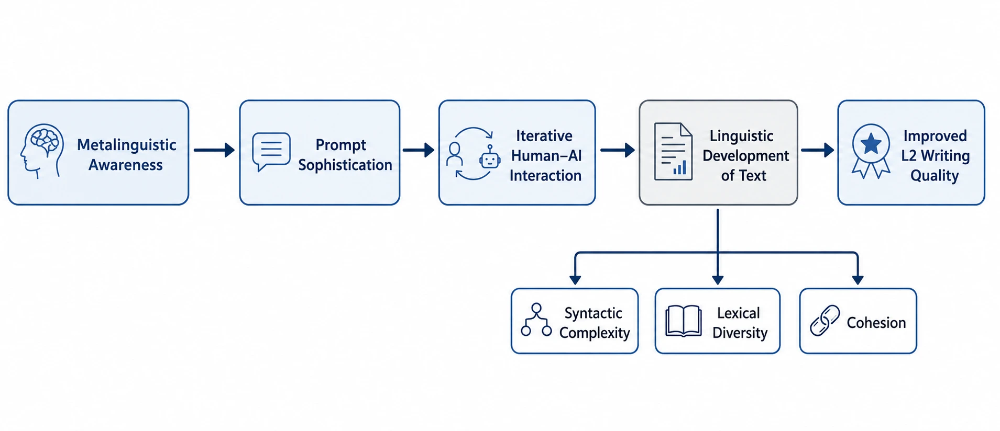

# Co-Regulatory-Model-AI-Writing
Official repository for the "Co-Regulatory Model of AI-Assisted Writing" study. Featuring datasets on iterative prompting, prompt literacy, and human-AI interaction in L2 academic contexts.

# AI-Assisted L2 Academic Writing: Reproducibility Package
‌
This repository contains the supplementary data, analysis scripts, and appendices for the following research paper:
‌
**Title:** The Co-regulatory Model of AI-Assisted L2 Academic Writing: Investigating the Impact of Iterative Prompting on Textual Development
**Author:** Dr. Pegah Merrikhi
**Status:** Submitted to Springer (International Journal of Artificial Intelligence in Education)
‌
## 📝 Project Overview
This study investigates how L2 learners engage in iterative interaction with Generative AI systems. We propose a **Co-Regulatory Model** that views writing improvement as an emergent outcome of shared regulation between the learner and the AI. A key contribution of this work is the conceptualization of **"Prompt Literacy"** as an emerging dimension of multilingual digital competence.
‌
## 📂 Repository Structure
- `/data`: Anonymized datasets containing linguistic indices (MTLD for lexical diversity, Mean Sentence Length for syntactic complexity, and LSA for semantic cohesion) across three text versions (V1, V2, V3).
- `/notebooks`: Python scripts (Jupyter Notebooks) used for statistical analysis, including Repeated Measures ANOVA and developmental trend visualizations.
- `/figures`: High-resolution versions of the Co-Regulatory Model framework and standardized growth charts.
- `/appendices`: Supplementary documentation, including the **Prompt Quality Rubric (PQR)** and categorized examples of Functional, Stylistic, and Metalinguistic prompts.
‌
## 🛠 Analysis Tools
The linguistic analysis in this study was conducted using:
- **Coh-Metrix 3.0:** For multilevel analysis of text characteristics.
- **Python (Pingouin & Pandas):** For inferential statistics and data visualization.
‌
## 🎓 Citation
If you use this data or the Co-Regulatory framework in your research, please cite the manuscript as follows:
> Merrikhi, P. (2024). *The Co-regulatory Model of AI-Assisted L2 Academic Writing: Investigating the Impact of Iterative Prompting on Textual Development*. [Manuscript submitted for publication].
‌
## ⚖️ License
This project is licensed under the **Creative Commons Attribution 4.0 International (CC BY 4.0)**. You are free to share and adapt the material as long as appropriate credit is given.
‌
---
**Contact:** For inquiries regarding the data or methodology, please contact Dr. Pegah Merrikhi.
Deniz.qizi@gmail.com
Pegah.merrrikhiii@gmail.com

+905369574614 whatsapp 
